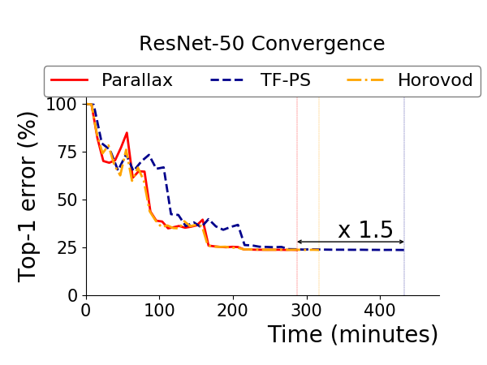
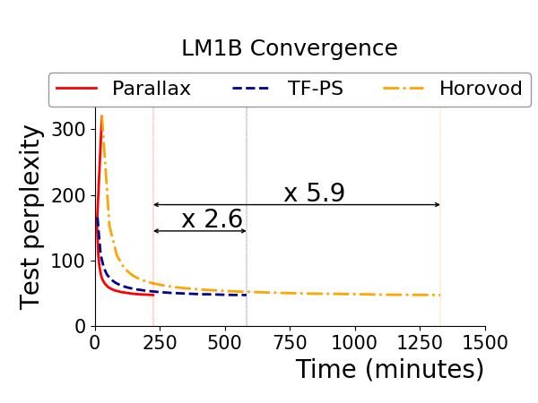

# Parallal
**Parallal** is a tool that optimizes data parallel training by considering whether each variable in a deep learning model is sparse or dense. The sparsity-aware data parallel training improves performance of models with sparse variables that show relatively low scalability on existing frameworks while maintaining equal performance for models with only dense variables such as ResNet-50 and Inception-V3. In addition, Parallal automatically parallelizes training of a single-GPU deep learning model to minimize user efforts. 

Parallal is currently implemented on TensorFlow. We support [TensorFlow v1.6](https://github.com/tensorflow/tensorflow/tree/r1.6) and [TensorFlow v1.11](https://github.com/tensorflow/tensorflow/tree/r1.11). In case that Parallal uses Message Passing Interface (MPI), Parallal requires *AllReduce*, *AllGather* operations implemented in [Horovod v0.11.2](https://github.com/uber/horovod/tree/v0.11.2). We plan to support multiple TensorFlow versions. 

* [Installation](doc/installation.md)
* [Running Parallal](doc/quick_start.md)
* [Parallal API](doc/Parallal_api.md)

## Why Parallal?
Parallal makes it easier for users to do distributed training of a deep learning model developed in a single device (e.g., GPU or CPU) while employing various optimization techniques that Parallal provides. A Parallal user simply specifies a single-device model graph, resource specification for distributed training and Parallal does the rest! For distributed training, Parallal supports hybrid architecture that combines two different distributed training architectures: Parameter Server (PS) and AllReduce (AR). Hybrid architecture exploits the advantages of both architectures. Moreover, Parallal will provide large sparse variable partitioning soon to maximize parallelism while maintaining low computation and communication overhead. Parallal further optimizes training with local aggregation and smart operation placement to mitigate communication overhead. 

PS and AR architectures are still available in Parallal; users can choose the training architecture if they want (default is hybrid for synchronous training).

### Hybrid Architecture

The amount of data transfer of each PS and AR achitecture changes according to whether a variable is sparse or dense. Based on the fact, Parallal pursues a hybrid architecture in which the AR architecture handles dense variables and the PS architecture handles sparse variables to minimize communication overhead. Each worker has a replica of dense variables, while separate server processes manage only sparse variables.

### Parallal Execution Model

When a client initiates a deep learning job with a single-device computation graph, resource information, and optionally a flag that indicates either synchronous or asynchronous training, Parallal transforms the computation graph by analyzing its characteristics. Then, Parallal executes the transformed graph with its optimized communication layer in the distributed environment.

### Parallal Benchmark

To give you an idea on how well Parallal performs, we present the following chart that shows the result of experiments done in a cluster of eight machines that are connected via Mellanox ConnectX-4 cards with 100Gbps InfiniBand. Each machine has six NVIDIA GeForce TITAN Xp GPU cards.

  
  

Parallal converges correctly as other frameworks(TensorFlow and Horovod). Parallal is faster than TensorFlow and similiar to Horovod for ResNet50 (dense model). In case of LM1B (sparse model), Parallal outperforms than both TensorFlow and Horovod.

  

Parallal outperforms TensorFlow for both Resnet50 and LM1B. In addition, Parallal outperforms Horovod for LM1B.

